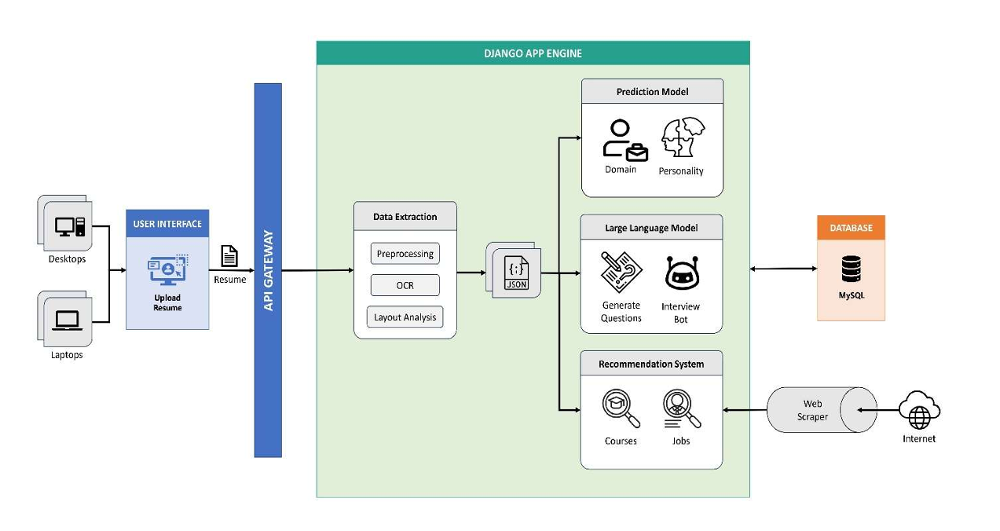

# 🚀 RiseUp – AI-Powered Career Guidance Platform

**RiseUp** is an intelligent, end-to-end career guidance platform that harnesses cutting-edge AI, NLP, and psychometric modeling to provide personalized career insights. From advanced resume parsing to domain prediction, personality profiling, and AI-led interview simulations, RiseUp is a full-spectrum career companion designed for the modern job seeker.

---

## 📌 Key Features

### 🧾 Resume Parsing (Layout-Aware)
- Uses **YOLOv11m + DocLayNet** for layout-aware parsing of resumes (PDF/image).
- Extracts structured information (education, skills, experience) into JSON.
- Supports both standard and complex resume formats.

### 🔍 Career Domain Prediction
- Fine-tuned **BERT-based classifier** maps resume text to **24+ job categories**.
- Robust preprocessing (stopword removal, lemmatization, EDA).

### 🧠 Personality Profiling
- Based on the **OCEAN model (Big Five traits)**.
- Clustering (K-Means) + **Random Forest** classification.
- Generates labeled personality types (e.g., "Ambitious Leader", "Detail-Oriented").

### 🎯 Niche Role Identification
- Extracts resume-specific details via NER + layout parsing.
- Prompts a **Large Language Model** to generate targeted job role suggestions.
- Uses semantic filtering and real-time job trends for refinement.

### 💬 AI-Generated Interview Q&A
- Personalized, domain-specific questions generated using **LLMs (e.g., LLaMA)**.
- Ideal answers are synthesized for evaluation and feedback.

### 🎤 Interview Bot (Speech-Based Evaluation)
- **Whisper** transcribes audio responses.
- LLMs evaluate technical accuracy, fluency, and confidence.
- Generates a detailed PDF report with feedback.

### 💼 Job Recommendation Engine
- Live job listings scraped from Naukri.com using Selenium.
- TF-IDF + NER + hybrid scoring (skills + semantic match).
- Dynamic, real-time job matches ranked for relevance.

### 📚 Course Recommendation Engine
- Scrapes Coursera via **Crawl4AI**.
- Analyzes skill gaps from resume and job targets.
- Recommends personalized learning paths using TF-IDF + cosine similarity.

---

## 🏗️ System Architecture

RiseUp follows a modular, scalable architecture composed of the following layers:

```
[ Angular Frontend ]
        ↓
[ Django REST API Gateway ]
        ↓
[ Backend ML Modules ]
        ↓
[ MySQL Database + Web Scrapers ]
```

### 🔧 Backend Modules:
- **Resume Parser**: LayoutParser + Tesseract / LLM for structured extraction.
- **Domain Predictor**: BERT classifier.
- **Personality Analyzer**: Big Five + Clustering + Random Forest.
- **LLM Q&A Engine**: Domain-specific question-answer generation.
- **Interview Evaluator**: Whisper + LLM scoring + report generation.
- **Recommendation Engines**: TF-IDF + live scraping (Naukri, Coursera).

---

## 🧪 Tech Stack

| Layer              | Technologies Used                              |
|--------------------|-------------------------------------------------|
| Frontend           | Angular                                         |
| Backend            | Django, Django REST Framework                   |
| NLP & ML           | BERT, YOLOv11m, LLaMA, Whisper, Random Forest   |
| Database           | MySQL                                           |
| Scraping           | Selenium, undetected-chromedriver, Crawl4AI     |
| OCR & Parsing      | LayoutParser, Tesseract, Fitz                   |
| LLM Integration    | Custom prompt engineering for Q&A & Evaluation |

---

## 🗺️ Functional Workflow

1. **User uploads resume** → Processed by OCR and Layout-Aware Parser  
2. **Domain predicted** using BERT → Specialized job roles generated via LLM  
3. **Personality test completed** → Clustered personality profile generated  
4. **Interview Q&A generated** → AI evaluates user’s audio responses  
5. **Jobs and courses recommended** based on real-time scraping + TF-IDF similarity

---

## 🧑‍💻 Setup Instructions

```bash
# 1. Clone the repository
git clone https://github.com/your-username/riseup.git
python -m venv venv

.\venv\Scripts\activate

pip install -r .\requirements.txt

pip install Django

python -m django --version

django-admin startproject capstone

cd capstone

python manage.py startapp riseupApp

===================== TO RUN PROJECT ==============================
cd capstone

python manage.py migrate  

python manage.py runserver
```

> Note: Whisper and LLaMA model integration requires GPU support and local hosting of models. Refer to `docs/setup.md` for full configuration.

---

## 📈 Screenshot

> System architecture
> 


---

## 🤖 Model & Dataset References

- [YOLOv11m-DocLayNet](https://github.com/Layout-Parser/layout-parser)
- [BERT](https://huggingface.co/bert-base-uncased)
- [Whisper by OpenAI](https://github.com/openai/whisper)
- [OCEAN Big Five Dataset](https://ipip.ori.org/)
- [LLaMA](https://github.com/facebookresearch/llama)

---


## 🛡️ License

This project is licensed under the MIT License. See the `LICENSE` file for details.

---


## 🙋 Contact

Built with ❤️ by [Your Name](https://github.com/your-username)

> For questions, collaboration, or deployment support, reach out at your.email@example.com
